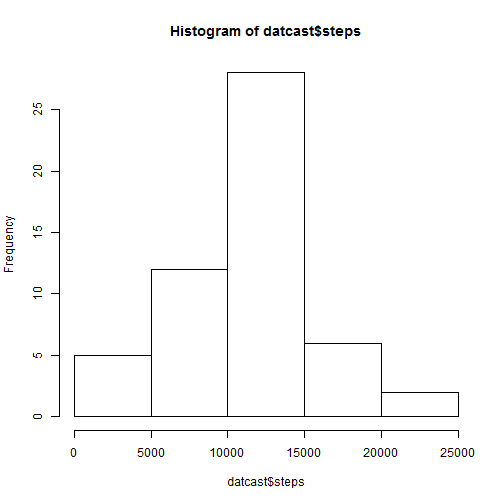
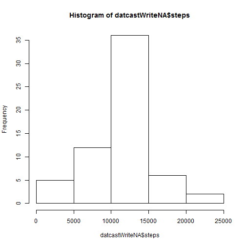

This is a R markdown file for assessing monitoring data from devices such as the Fitbit, Nike Fuelband or Jawbone.

## Loading and preprocessing the data

The first part sets the working directory and loads required packages.

```r
setwd("C:/Users/Christina2/Documents/Data Science/5 - Reproducible Research/PeerAssess1")
library(reshape)
library(reshape2)
```

Read the downloaded comma separated file.

```r
data <- read.csv("activity.csv")
```
Omit the rows with NA values.

```r
data2 <- na.omit(data)
```

## What is the mean total number of steps taken per day?

Melt the table according to 'date'

```r
dat <- melt(data2, id.vars="date")
```
Recast and plot histogram

```r
datcast <- dcast(dat, date ~ variable, fun.aggregate = sum)
datcast$interval <- NULL
hist(datcast$steps)
```

 

The mean of the average daily steps is 

```r
mean(datcast$steps)
```

```
## [1] 10766.19
```
The median of the average daily steps is

```r
median(datcast$steps)
```

```
## [1] 10765
```

## What is the average daily activity pattern?

```r
dat2 <- melt(data2, id.var="interval", measure.var="steps")
dat2cast <- dcast(dat2, interval ~ variable, value.var="value", fun.aggregate = mean)
plot(dat2cast, type="l")
```

 

The maximum number of steps, on average, happens on the following 5-min interval:

```r
dat2cast[which.max(dat2cast$steps),]
```

```
##     interval    steps
## 104      835 206.1698
```

## Imputting missing values

The total number of missing values (rows) in the data set is:

```r
nrow(data)-nrow(data2)
```

```
## [1] 2304
```

Missing values (NA) will be written with the mean for the respective 5-min interval

```r
dataWriteNA <- data
for (i in 1:17568)
{
if (is.na(dataWriteNA[i,1])) {
  dataWriteNA[i,1] <- dat2cast[which(dat2cast$interval == dataWriteNA[i,3]),2]
                      }
}
head(dataWriteNA)
```

```
##       steps       date interval
## 1 1.7169811 2012-10-01        0
## 2 0.3396226 2012-10-01        5
## 3 0.1320755 2012-10-01       10
## 4 0.1509434 2012-10-01       15
## 5 0.0754717 2012-10-01       20
## 6 2.0943396 2012-10-01       25
```

```r
datWriteNA <- melt(dataWriteNA, id.vars="date")
datcastWriteNA <- dcast(datWriteNA, date ~ variable, fun.aggregate = sum)
datcastWriteNA$interval <- NULL
hist(datcastWriteNA$steps)
```

 

The mean of the average daily steps, with replaced missing values, is:

```r
mean(datcastWriteNA$steps)
```

```
## [1] 10766.19
```
The median of the average daily steps, with replaced missing values, is:

```r
median(datcastWriteNA$steps)
```

```
## [1] 10766.19
```

## Are there differences in activity patterns between weekdays and weekends?

```r
datcastWriteNA$day <- weekdays(as.Date(datcastWriteNA$date))

for (i in 1:61)
{
  if (datcastWriteNA[i,3] %in% c("Saturday","Sunday")) {
    datcastWriteNA[i,4] <- "weekend"}
    else {
      datcastWriteNA[i,4] <- "weekday"
    }
}
```


